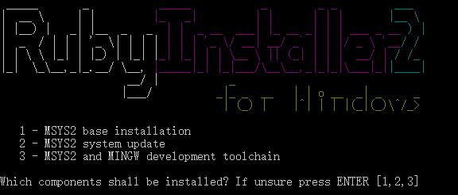

Ruby，一种简单快捷的面向对象（面向对象程序设计）脚本语言，在20世纪90年代由日本人松本行弘(Yukihiro Matsumoto)开发，遵守GPL协议和Ruby License。它的灵感与特性来自于 Perl、Smalltalk、Eiffel、Ada以及 Lisp 语言。由 Ruby 语言本身还发展出了JRuby（Java平台）、IronRuby（.NET平台）等其他平台的 Ruby 语言替代品。Ruby的作者于1993年2月24日开始编写Ruby，直至1995年12月才正式公开发布于fj（新闻组）。因为Perl发音与6月诞生石pearl（珍珠）相同，因此Ruby以7月诞生石ruby（红宝石）命名。

<http://www.ruby-lang.org/zh_cn/documentation/installation/>

## 安装

使用[rubyinstaller](https://rubyinstaller.org/)工具进行安装，直接下载完成安装

安装完成后，提示是否安装[MSYS2](MSYS2)如下图

## 参考
[百度百科](http://baike.baidu.com/link?url=0ba5k22VMI6PaA5_6pUS_mrMJZ3o1qigo2RL1nsWkZ-OzpJ3ZWjNy_zCdbijly7z4svo0uXQPCNV6sc0kwEctK)