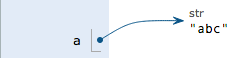
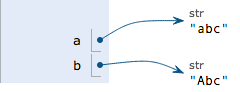

[TOC]
## python基础

### 数据类型

#### 整数

#### 浮点数

#### 字符串

#### 布尔值

#### 空值

#### 变量

#### 常量

#### 除法

最后解释一下整数的除法为什么也是精确的。在Python中，有两种除法，一种除法是`/`：

```
>>> 10 / 3
3.3333333333333335

```

`/`除法计算结果是浮点数，即使是两个整数恰好整除，结果也是浮点数：

```
>>> 9 / 3
3.0

```

还有一种除法是`//`，称为地板除，两个整数的除法仍然是整数：

```
>>> 10 // 3
3

```

你没有看错，整数的地板除`//`永远是整数，即使除不尽。要做精确的除法，使用`/`就可以。

因为`//`除法只取结果的整数部分，所以Python还提供一个余数运算，可以得到两个整数相除的余数：

```
>>> 10 % 3
1

```

无论整数做`//`除法还是取余数，结果永远是整数，所以，整数运算结果永远是精确的。

所谓常量就是不能变的变量，比如常用的数学常数π就是一个常量。在Python中，通常用全部大写的变量名表示常量：

```
PI = 3.14159265359

```

但事实上`PI`仍然是一个变量，Python根本没有任何机制保证`PI`不会被改变，所以，用全部大写的变量名表示常量只是一个习惯上的用法，如果你一定要改变变量`PI`的值，也没人能拦住你。

### 输入和输出

`print()`会依次打印每个字符串，遇到逗号“,”会输出一个空格，

Python提供了一个`input()`，可以让用户输入字符串，并存放到一个变量里。比如输入用户的名字：

```
>>> name = input()
Michael
```

### 字符和编码

#### 字符编码


| 字符   | ASCII    | Unicode           | UTF-8                      |
| ---- | -------- | ----------------- | -------------------------- |
| A    | 01000001 | 00000000 01000001 | 01000001                   |
| 中    | -        | 01001110 00101101 | 11100100 10111000 10101101 |

浏览网页的时候，服务器会把动态生成的Unicode内容转换为UTF-8再传输到浏览器：


#### Python的字符串
在最新的Python 3版本中，字符串是以Unicode编码的，也就是说，Python的字符串支持多语言。

由于Python的字符串类型是`str`，在内存中以Unicode表示，一个字符对应若干个字节。如果要在网络上传输，或者保存到磁盘上，就需要把`str`变为以字节为单位的`bytes`。

Python对`bytes`类型的数据用带`b`前缀的单引号或双引号表示：

```
x = b'ABC'
```

以Unicode表示的`str`通过`encode()`方法可以编码为指定的`bytes`，例如：

```
>>> 'ABC'.encode('ascii')
b'ABC'
>>> '中文'.encode('utf-8')
b'\xe4\xb8\xad\xe6\x96\x87'
>>> '中文'.encode('ascii')
Traceback (most recent call last):
  File "<stdin>", line 1, in <module>
UnicodeEncodeError: 'ascii' codec can't encode characters in position 0-1: ordinal not in range(128)
```

在操作字符串时，我们经常遇到`str`和`bytes`的互相转换。为了避免乱码问题，应当始终坚持使用UTF-8编码对`str`和`bytes`进行转换。

由于Python源代码也是一个文本文件，所以，当你的源代码中包含中文的时候，在保存源代码时，就需要务必指定保存为UTF-8编码。当Python解释器读取源代码时，为了让它按UTF-8编码读取，我们通常在文件开头写上这两行：

```
#!/usr/bin/env python3
# -*- coding: utf-8 -*-

```

第一行注释是为了告诉Linux/OS X系统，这是一个Python可执行程序，Windows系统会忽略这个注释；

第二行注释是为了告诉Python解释器，按照UTF-8编码读取源代码，否则，你在源代码中写的中文输出可能会有乱码。

#### 格式化

在Python中，采用的格式化方式和C语言是一致的，用`%`实现，举例如下：

```
>>> 'Hello, %s' % 'world'
'Hello, world'
>>> 'Hi, %s, you have $%d.' % ('Michael', 1000000)
'Hi, Michael, you have $1000000.'
```

常见的占位符有：

| %d   | 整数     |
| ---- | ------ |
| %f   | 浮点数    |
| %s   | 字符串    |
| %x   | 十六进制整数 |


```python
>>> print ('%.1f%%' % 87.345)
87.3%
```


### 使用list和tuple(元组)

#### list

Python内置的一种数据类型是列表：list。list是一种有序的集合，可以随时添加和删除其中的元素。

比如，列出班里所有同学的名字，就可以用一个list表示：

```
>>> classmates = ['Michael', 'Bob', 'Tracy']
>>> classmates
['Michael', 'Bob', 'Tracy']
```

用索引来访问list中每一个位置的元素，记得索引是从`0`开始的：

```
>>> classmates[0]
'Michael'
>>> classmates[1]
'Bob'
```

以此类推，可以获取倒数第2个、倒数第3个：

```
>>> classmates[-2]
'Bob'
>>> classmates[-3]
'Michael'
```

也可以把元素插入到指定的位置，比如索引号为`1`的位置：

```
>>> classmates.insert(1, 'Jack')
>>> classmates
['Michael', 'Jack', 'Bob', 'Tracy', 'Adam']
```

要删除list末尾的元素，用`pop()`方法：

```
>>> classmates.pop()
'Adam'
>>> classmates
['Michael', 'Jack', 'Bob', 'Tracy']
```

#### 使用list和tuple

阅读: 885727

------

#### list

Python内置的一种数据类型是列表：list。list是一种有序的集合，可以随时添加和删除其中的元素。

比如，列出班里所有同学的名字，就可以用一个list表示：

```
>>> classmates = ['Michael', 'Bob', 'Tracy']
>>> classmates
['Michael', 'Bob', 'Tracy']

```

变量`classmates`就是一个list。用`len()`函数可以获得list元素的个数：

```
>>> len(classmates)
3

```

用索引来访问list中每一个位置的元素，记得索引是从`0`开始的：

```
>>> classmates[0]
'Michael'
>>> classmates[1]
'Bob'
>>> classmates[2]
'Tracy'
>>> classmates[3]
Traceback (most recent call last):
  File "<stdin>", line 1, in <module>
IndexError: list index out of range

```

当索引超出了范围时，Python会报一个IndexError错误，所以，要确保索引不要越界，记得最后一个元素的索引是`len(classmates) - 1`。

如果要取最后一个元素，除了计算索引位置外，还可以用`-1`做索引，直接获取最后一个元素：

```
>>> classmates[-1]
'Tracy'

```

以此类推，可以获取倒数第2个、倒数第3个：

```
>>> classmates[-2]
'Bob'
>>> classmates[-3]
'Michael'
>>> classmates[-4]
Traceback (most recent call last):
  File "<stdin>", line 1, in <module>
IndexError: list index out of range

```

当然，倒数第4个就越界了。

list是一个可变的有序表，所以，可以往list中追加元素到末尾：

```
>>> classmates.append('Adam')
>>> classmates
['Michael', 'Bob', 'Tracy', 'Adam']

```

也可以把元素插入到指定的位置，比如索引号为`1`的位置：

```
>>> classmates.insert(1, 'Jack')
>>> classmates
['Michael', 'Jack', 'Bob', 'Tracy', 'Adam']

```

要删除list末尾的元素，用`pop()`方法：

```
>>> classmates.pop()
'Adam'
>>> classmates
['Michael', 'Jack', 'Bob', 'Tracy']

```

要删除指定位置的元素，用`pop(i)`方法，其中`i`是索引位置：

```
>>> classmates.pop(1)
'Jack'
>>> classmates
['Michael', 'Bob', 'Tracy']

```

要把某个元素替换成别的元素，可以直接赋值给对应的索引位置：

```
>>> classmates[1] = 'Sarah'
>>> classmates
['Michael', 'Sarah', 'Tracy']

```

list里面的元素的数据类型也可以不同，比如：

```
>>> L = ['Apple', 123, True]

```

list元素也可以是另一个list，比如：

```python
>>> s = ['python', 'java', ['asp', 'php'], 'scheme']
>>> len(s)
4
```

####  tuple元组

tuple和list非常类似，但是tuple一旦初始化就不能修改

不可变的tuple有什么意义？因为tuple不可变，所以代码更安全。如果可能，能用tuple代替list就尽量用tuple。

只有1个元素的tuple定义时必须加一个逗号`,`，来消除歧义：

```
>>> t = (1,)
>>> t
(1,)
```

最后来看一个“可变的”tuple：

```
>>> t = ('a', 'b', ['A', 'B'])
>>> t[2][0] = 'X'
>>> t[2][1] = 'Y'
>>> t
('a', 'b', ['X', 'Y'])
```

### 条件判断

`elif`是`else if`的缩写，完全可以有多个`elif`，所以`if`语句的完整形式就是：

```
if <条件判断1>:
    <执行1>
elif <条件判断2>:
    <执行2>
elif <条件判断3>:
    <执行3>
else:
    <执行4>
```

`if`判断条件还可以简写，比如写：

```
if x:
    print('True')

```

只要`x`是非零数值、非空字符串、非空list等，就判断为`True`，否则为`False`。

### 循环

#### for

Python的循环有两种，一种是for...in循环，依次把list或tuple中的每个元素迭代出来，看例子：

```
names = ['Michael', 'Bob', 'Tracy']
for name in names:
    print(name)

```

执行这段代码，会依次打印`names`的每一个元素：

```
Michael
Bob
Tracy
```

我们想计算1-10的整数之和，可以用一个`sum`变量做累加：

```
sum = 0
for x in [1, 2, 3, 4, 5, 6, 7, 8, 9, 10]:
    sum = sum + x
print(sum)
```

从1写到100有点困难，幸好Python提供一个`range()`函数，可以生成一个整数序列，再通过`list()`函数可以转换为list。比如`range(5)`生成的序列是从0开始小于5的整数：

```
>>> list(range(5))
[0, 1, 2, 3, 4]

```

`range(101)`就可以生成0-100的整数序列，计算如下：

```
sum = 0
for x in range(101):
    sum = sum + x
print(sum)
```

#### while

第二种循环是while循环，只要条件满足，就不断循环，条件不满足时退出循环。比如我们要计算100以内所有奇数之和，可以用while循环实现：

```
sum = 0
n = 99
while n > 0:
    sum = sum + n
    n = n - 2
print(sum)

```

在循环内部变量`n`不断自减，直到变为`-1`时，不再满足while条件，循环退出。

#### break

在循环中，`break`语句可以提前退出循环。

例如，本来要循环打印1～100的数字：

```
n = 1
while n <= 100:
    print(n)
    n = n + 1
print('END')

```

上面的代码可以打印出1~100。

如果要提前结束循环，可以用`break`语句：

```
n = 1
while n <= 100:
    if n > 10: # 当n = 11时，条件满足，执行break语句
        break # break语句会结束当前循环
    print(n)
    n = n + 1
print('END')
```
#### continue

在循环过程中，也可以通过`continue`语句，跳过当前的这次循环，直接开始下一次循环。

```
n = 0
while n < 10:
    n = n + 1
    print(n)

```

上面的程序可以打印出1～10。但是，如果我们想只打印奇数，可以用`continue`语句跳过某些循环：

```
n = 0
while n < 10:
    n = n + 1
    if n % 2 == 0: # 如果n是偶数，执行continue语句
        continue # continue语句会直接继续下一轮循环，后续的print()语句不会执行
    print(n)
```

#### 要特别注意

不要滥用`break`和`continue`语句。`break`和`continue`会造成代码执行逻辑分叉过多，容易出错。大多数循环并不需要用到`break`和`continue`语句，上面的两个例子，都可以通过改写循环条件或者修改循环逻辑，去掉`break`和`continue`语句。

有些时候，如果代码写得有问题，会让程序陷入“死循环”，也就是永远循环下去。这时可以用`Ctrl+C`退出程序，或者强制结束Python进程。

### 使用dict和set

#### dict

Python内置了字典：dict的支持，dict全称dictionary，在其他语言中也称为map，使用键-值（key-value）存储，具有极快的查找速度。

举个例子，假设要根据同学的名字查找对应的成绩

如果用dict实现，只需要一个“名字”-“成绩”的对照表，直接根据名字查找成绩，无论这个表有多大，查找速度都不会变慢。用Python写一个dict如下：

```python
>>> d = {'Michael': 95, 'Bob': 75, 'Tracy': 85}
>>> d['Michael']
95
```

##### 为什么dict查找速度这么快？

因为dict的实现原理和查字典是一样的。假设字典包含了1万个汉字，我们要查某一个字，一个办法是把字典从第一页往后翻，直到找到我们想要的字为止，这种方法就是在list中查找元素的方法，list越大，查找越慢。

第二种方法是先在字典的索引表里（比如部首表）查这个字对应的页码，然后直接翻到该页，找到这个字。无论找哪个字，这种查找速度都非常快，不会随着字典大小的增加而变慢。dict就是第二种实现方式，

把数据放入dict的方法，除了初始化时指定外，还可以通过key放入：

```
>>> d['Adam'] = 67
>>> d['Adam']
67
```

由于一个key只能对应一个value，所以，多次对一个key放入value，后面的值会把前面的值冲掉：

```
>>> d['Jack'] = 90
>>> d['Jack']
90
>>> d['Jack'] = 88
>>> d['Jack']
88

```

如果key不存在，dict就会报错：

```
>>> d['Thomas']
Traceback (most recent call last):
  File "<stdin>", line 1, in <module>
KeyError: 'Thomas'
```

要避免key不存在的错误，有两种办法，一是通过`in`判断key是否存在：

```
>>> 'Thomas' in d
False

```


##### 使用dict提供的get方法

如果key不存在，可以返回None，或者自己指定的value：

```
>>> d.get('Thomas')
>>> d.get('Thomas', -1)
-1
```
使用get方法指定value后，不会改变原有的dict：

```
>>> d
{'Michael': 95, 'Bob': 75, 'Tracy': 85}
>>> d.get('Thomas', -1)
-1
>>> d
{'Michael': 95, 'Bob': 75, 'Tracy': 85}
>>>
```


注意：返回`None`的时候Python的交互式命令行不显示结果。

##### 使用pop(key)删除一个key

要删除一个key，用`pop(key)`方法，对应的value也会从dict中删除：

```
>>> d.pop('Bob')
75
>>> d
{'Michael': 95, 'Tracy': 85}

```

请务必注意，dict内部存放的顺序和key放入的顺序是没有关系的。

##### 和list比较，dict有以下几个特点：

1. 查找和插入的速度极快，不会随着key的增加而变慢；
2. 需要占用大量的内存，内存浪费多。

而list相反：

1. 查找和插入的时间随着元素的增加而增加；
2. 占用空间小，浪费内存很少。

所以，dict是用空间来换取时间的一种方法。

##### dict的key必须是**不可变对象**

dict可以用在需要高速查找的很多地方，在Python代码中几乎无处不在，正确使用dict非常重要，需要牢记的第一条就是dict的key必须是**不可变对象**。

这是因为dict根据key来计算value的存储位置，如果每次计算相同的key得出的结果不同，那dict内部就完全混乱了。这个通过key计算位置的算法称为哈希算法（Hash）。

要保证hash的正确性，作为key的对象就不能变。在Python中，字符串、整数等都是不可变的，因此，可以放心地作为key。而list是可变的，就不能作为key：

```
>>> key = [1, 2, 3]
>>> d[key] = 'a list'
Traceback (most recent call last):
  File "<stdin>", line 1, in <module>
TypeError: unhashable type: 'list'
```

#### set

set和dict类似，也是一组key的集合，但不存储value。由于key不能重复，所以，在set中，没有重复的key。

要创建一个set，需要提供一个list作为输入集合：

```
>>> s = set([1, 2, 3])
>>> s
{1, 2, 3}
```

注意，传入的参数`[1, 2, 3]`是一个list，而显示的`{1, 2, 3}`只是告诉你这个set内部有1，2，3这3个元素，显示的顺序也不表示set是有序的。

重复元素在set中自动被过滤：

```
>>> s = set([1, 1, 2, 2, 3, 3])
>>> s
{1, 2, 3}
```

##### 通过`add(key)`方法可以添加元素到set中，可以重复添加，但不会有效果：

```
>>> s.add(4)
>>> s
{1, 2, 3, 4}
>>> s.add(4)
>>> s
{1, 2, 3, 4}

```

##### 通过`remove(key)`方法可以删除元素：

```
>>> s.remove(4)
>>> s
{1, 2, 3}
```

set可以看成数学意义上的无序和无重复元素的集合，因此，两个set可以做数学意义上的交集、并集等操作：

```
>>> s1 = set([1, 2, 3])
>>> s2 = set([2, 3, 4])
>>> s1 & s2
{2, 3}
>>> s1 | s2
{1, 2, 3, 4}
```

#### set和dict的唯一区别

仅在于没有存储对应的value，但是，set的原理和dict一样，所以，同样不可以放入可变对象，因为无法判断两个可变对象是否相等，也就无法保证set内部“不会有重复元素”。试试把list放入set，看看是否会报错。

#### 再议不可变对象

上面我们讲了，str是不变对象，而list是可变对象。

对于可变对象，比如list，对list进行操作，list内部的内容是会变化的，比如：

```
>>> a = ['c', 'b', 'a']
>>> a.sort()
>>> a
['a', 'b', 'c']

```

而对于不可变对象，比如str，对str进行操作呢：

```
>>> a = 'abc'
>>> a.replace('a', 'A')
'Abc'
>>> a
'abc'

```

虽然字符串有个`replace()`方法，也确实变出了`'Abc'`，但变量`a`最后仍是`'abc'`，应该怎么理解呢？

我们先把代码改成下面这样：

```
>>> a = 'abc'
>>> b = a.replace('a', 'A')
>>> b
'Abc'
>>> a
'abc'
```

要始终牢记的是，`a`是变量，而`'abc'`才是字符串对象！有些时候，我们经常说，对象`a`的内容是`'abc'`，但其实是指，`a`本身是一个变量，它指向的对象的内容才是`'abc'`：



当我们调用`a.replace('a', 'A')`时，实际上调用方法`replace`是作用在字符串对象`'abc'`上的，而这个方法虽然名字叫`replace`，但却没有改变字符串`'abc'`的内容。相反，`replace`方法创建了一个新字符串`'Abc'`并返回，如果我们用变量`b`指向该新字符串，就容易理解了，变量`a`仍指向原有的字符串`'abc'`，但变量`b`却指向新字符串`'Abc'`了：



所以，对于不变对象来说，调用对象自身的任意方法，也不会改变该对象自身的内容。相反，这些方法会创建新的对象并返回，这样，就保证了不可变对象本身永远是不可变的。

## 函数

我们知道圆的面积计算公式为：

S = πr2

当我们知道半径`r`的值时，就可以根据公式计算出面积。假设我们需要计算3个不同大小的圆的面积：

```
r1 = 12.34
r2 = 9.08
r3 = 73.1
s1 = 3.14 * r1 * r1
s2 = 3.14 * r2 * r2
s3 = 3.14 * r3 * r3

```

当代码出现有规律的重复的时候，你就需要当心了，每次写`3.14 * x * x`不仅很麻烦，而且，如果要把`3.14`改成`3.14159265359`的时候，得全部替换。

有了函数，我们就不再每次写`s = 3.14 * x * x`，而是写成更有意义的函数调用`s = area_of_circle(x)`，而函数`area_of_circle`本身只需要写一次，就可以多次调用。

基本上所有的高级语言都支持函数，Python也不例外。Python不但能非常灵活地定义函数，而且本身内置了很多有用的函数，可以直接调用。

#### 抽象

抽象是数学中非常常见的概念。举个例子：

计算数列的和，比如：`1 + 2 + 3 + ... + 100`，写起来十分不方便，于是数学家发明了求和符号∑，可以把`1 + 2 + 3 + ... + 100`记作：

100

∑n

n=1

这种抽象记法非常强大，因为我们看到 ∑ 就可以理解成求和，而不是还原成低级的加法运算。

而且，这种抽象记法是可扩展的，比如：

100

∑(n2+1)

n=1

还原成加法运算就变成了：

(1 x 1 + 1) + (2 x 2 + 1) + (3 x 3 + 1) + ... + (100 x 100 + 1)

可见，借助抽象，我们才能不关心底层的具体计算过程，而直接在更高的层次上思考问题。

写计算机程序也是一样，函数就是最基本的一种代码抽象的方式。

### 调用函数

Python内置了很多有用的函数，我们可以直接调用。

要调用一个函数，需要知道函数的名称和参数，比如求绝对值的函数`abs`，只有一个参数。可以直接从Python的官方网站查看文档：

[http://docs.python.org/3/library/functions.html#abs](http://docs.python.org/3/library/functions.html#abs)

也可以在交互式命令行通过`help(abs)`查看`abs`函数的帮助信息。

函数名其实就是指向一个函数对象的引用，完全可以把函数名赋给一个变量，相当于给这个函数起了一个“别名”：

```python
>>> a = abs # 变量a指向abs函数
>>> a(-1) # 所以也可以通过a调用abs函数
1
```

调用函数的时候，如果传入的参数数量不对，会报`TypeError`的错误，并且Python会明确地告诉你：`abs()`有且仅有1个参数，但给出了两个：

```
>>> abs(1, 2)
Traceback (most recent call last):
  File "<stdin>", line 1, in <module>
TypeError: abs() takes exactly one argument (2 given)

```

如果传入的参数数量是对的，但参数类型不能被函数所接受，也会报`TypeError`的错误，并且给出错误信息：`str`是错误的参数类型：

```
>>> abs('a')
Traceback (most recent call last):
  File "<stdin>", line 1, in <module>
TypeError: bad operand type for abs(): 'str'
```

#### 数据类型转换

Python内置的常用函数还包括数据类型转换函数，比如`int()`函数可以把其他数据类型转换为整数：

```
>>> int('123')
123
>>> int(12.34)
12
>>> float('12.34')
12.34
>>> str(1.23)
'1.23'
>>> str(100)
'100'
>>> bool(1)
True
>>> bool('')
False
```

`hex()`函数把一个整数转换成十六进制表示的字符串：

### 定义函数

在Python中，定义一个函数要使用`def`语句，依次写出函数名、括号、括号中的参数和冒号`:`，然后，在缩进块中编写函数体，函数的返回值用`return`语句返回。

我们以自定义一个求绝对值的`my_abs`函数为例：

```
def my_abs(x):
    if x >= 0:
        return x
    else:
        return -x
```

请注意，函数体内部的语句在执行时，一旦执行到`return`时，函数就执行完毕，并将结果返回。因此，函数内部通过条件判断和循环可以实现非常复杂的逻辑。

如果没有`return`语句，函数执行完毕后也会返回结果，只是结果为`None`。

`return None`可以简写为`return`。

在Python交互环境中定义函数时，注意Python会出现`...`的提示。函数定义结束后需要按两次回车重新回到`>>>`提示符下

如果你已经把`my_abs()`的函数定义保存为`abstest.py`文件了，那么，可以在该文件的当前目录下启动Python解释器，用`from abstest import my_abs`来导入`my_abs()`函数，注意`abstest`是文件名（不含`.py`扩展名）：

#### 空函数

如果想定义一个什么事也不做的空函数，可以用`pass`语句：

```
def nop():
    pass

```

`pass`语句什么都不做，那有什么用？实际上`pass`可以用来作为占位符，比如现在还没想好怎么写函数的代码，就可以先放一个`pass`，让代码能运行起来。

`pass`还可以用在其他语句里，比如：

```
if age >= 18:
    pass

```

缺少了`pass`，代码运行就会有语法错误。

#### 参数检查

调用函数时，如果参数个数不对，Python解释器会自动检查出来，并抛出`TypeError`：

```python
>>> my_abs(1, 2)
Traceback (most recent call last):
  File "<stdin>", line 1, in <module>
TypeError: my_abs() takes 1 positional argument but 2 were given
```

但是如果参数类型不对，Python解释器就无法帮我们检查。试试`my_abs`和内置函数`abs`的差别：

```python
>>> my_abs('A')
Traceback (most recent call last):
  File "<stdin>", line 1, in <module>
  File "<stdin>", line 2, in my_abs
TypeError: unorderable types: str() >= int()
>>> abs('A')
Traceback (most recent call last):
  File "<stdin>", line 1, in <module>
TypeError: bad operand type for abs(): 'str'
```

对参数类型做检查，只允许整数和浮点数类型的参数。数据类型检查可以用内置函数`isinstance()`实现：

```
def my_abs(x):
    if not isinstance(x, (int, float)):
        raise TypeError('bad operand type')
    if x >= 0:
        return x
    else:
        return -x
```

#### 返回多个值

函数可以返回多个值

比如在游戏中经常需要从一个点移动到另一个点，给出坐标、位移和角度，就可以计算出新的新的坐标：

```
import math

def move(x, y, step, angle=0):
    nx = x + step * math.cos(angle)
    ny = y - step * math.sin(angle)
    return nx, ny

```

`import math`语句表示导入`math`包，并允许后续代码引用`math`包里的`sin`、`cos`等函数。

我们就可以同时获得返回值：

```
>>> x, y = move(100, 100, 60, math.pi / 6)
>>> print(x, y)
151.96152422706632 70.0

```

但其实这只是一种假象，Python函数返回的仍然是单一值：

```
>>> r = move(100, 100, 60, math.pi / 6)
>>> print(r)
(151.96152422706632, 70.0)
```

原来返回值是一个tuple！但是，在语法上，返回一个tuple可以省略括号，而多个变量可以同时接收一个tuple，按位置赋给对应的值，所以，Python的函数返回多值其实就是返回一个tuple，但写起来更方便。

#### 小结

定义函数时，需要确定函数名和参数个数；

如果有必要，可以先对参数的数据类型做检查；

函数体内部可以用`return`随时返回函数结果；

函数执行完毕也没有`return`语句时，自动`return None`。

函数可以同时返回多个值，但其实就是一个tuple。

### 函数的参数

